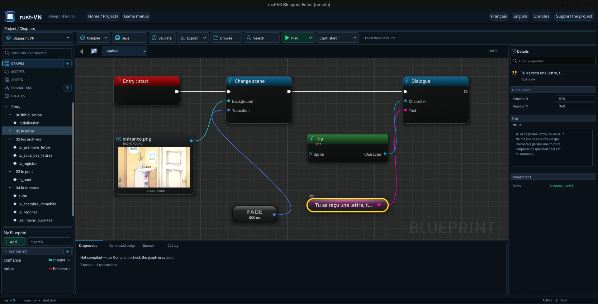
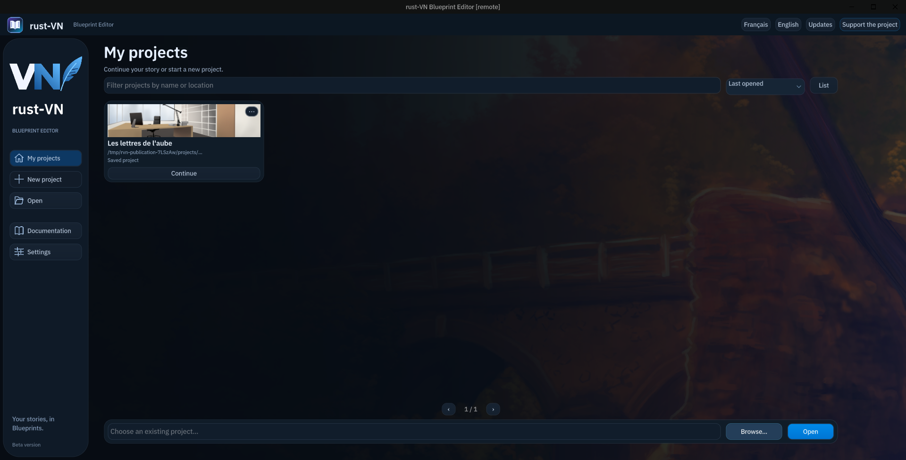
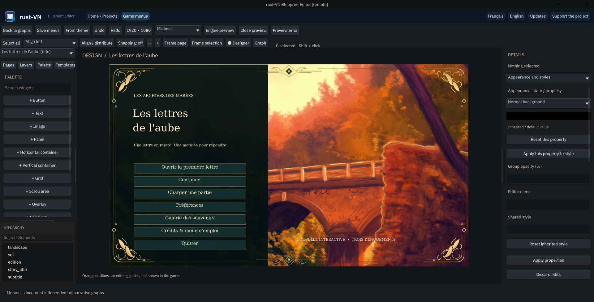

<div align="center">

# rust-VN Editor

### Vos histoires prennent forme.

Un éditeur visuel pour créer des visual novels, composer leur interface et préparer leur distribution.

[](https://github.com/dawsoncarsoulle-lab/rust-vn-releases/releases)
[](https://github.com/dawsoncarsoulle-lab/rust-vn-releases/releases/tag/v0.2.1)

[Télécharger](#télécharger) · [Installer](#installation) · [Mises à jour](#mises-à-jour) · [Vérifier un fichier](#intégrité-des-téléchargements) · [Soutenir](https://ko-fi.com/rustvn)

</div>

---



<p align="center"><em>Une histoire lisible sous forme de nœuds : point de départ, personnage et dialogue.</em></p>

## Créer, personnaliser, partager

rust-VN Editor réunit la création narrative et la composition d’interface dans un même environnement. Les graphes Blueprint permettent d’organiser les dialogues, les choix et les branches de l’histoire ; l’éditeur visuel d’interface permet de travailler sur les menus et leur présentation.

Le projet s’adresse aussi bien aux auteurs qui préfèrent une approche visuelle qu’aux utilisateurs souhaitant travailler sur des scripts RVN dans leur éditeur de code.

| Espace de création | Usage |
| :--- | :--- |
| **Histoire** | Organiser les graphes et les chapitres, relier les dialogues, les choix et les conditions. |
| **Mise en scène** | Utiliser les personnages, sprites, décors, musiques, sons et transitions du projet. |
| **Interface** | Composer les menus, personnaliser leur apparence et définir leurs interactions. |
| **Vérification** | Compiler les graphes, consulter les diagnostics et lancer le jeu depuis l’éditeur. |
| **Distribution** | Préparer une version du jeu à partager, selon les cibles disponibles dans la version installée. |

> L’application est en développement. Les notes de chaque version précisent les fonctionnalités livrées, les plateformes vérifiées et les limites connues. Elles font référence pour le paquet téléchargé.

## L’éditeur en images

### Un point de départ pour chaque histoire

L’accueil rassemble l’ouverture des projets et la création d’une nouvelle histoire.



### Une interface à composer visuellement

Le mode Design présente la page du jeu au centre, ses pages à gauche et les propriétés de présentation à droite. Ici, un menu principal simple utilise le thème Science-fiction.



<sub>Captures réelles de l’application de développement, réalisées sur un projet de test. Le suffixe « remote » identifie l’instance de capture. Les images ne sont pas des maquettes et peuvent différer des prochaines versions.</sub>

## Télécharger

**La version 0.2.1 est disponible pour Linux x86_64 et, à titre expérimental, Windows x86_64.** Consultez ses [notes et prérequis](https://github.com/dawsoncarsoulle-lab/rust-vn-releases/releases/tag/v0.2.1) avant de l’installer.

Les fichiers sont publiés dans les [Releases GitHub](https://github.com/dawsoncarsoulle-lab/rust-vn-releases/releases).

| Plateforme | Format | Disponibilité |
| :--- | :--- | :--- |
| Linux x86_64 | AppImage | [Télécharger la version 0.2.1](https://github.com/dawsoncarsoulle-lab/rust-vn-releases/releases/download/v0.2.1/rust-VN-Editor-x86_64.AppImage) |
| Windows x86_64 | ZIP portable expérimental | [Télécharger la version 0.2.1](https://github.com/dawsoncarsoulle-lab/rust-vn-releases/releases/download/v0.2.1/rust-VN-Editor-windows-x86_64.zip) |

Chaque publication indiquera sa configuration minimale et son niveau de validation. Une AppImage ne garantit pas la compatibilité avec toutes les distributions Linux ; un exécutable Windows compilé n’est pas nécessairement validé sur une machine Windows.

**Ne téléchargez pas « Source code (zip) » pour installer l’application.** Les archives de code proposées automatiquement par GitHub contiennent les fichiers de ce dépôt, pas l’éditeur.

## Installation

Le paquet Linux actuel requiert glibc 2.39 et les bibliothèques système de bureau décrites dans les notes de version. Il a été vérifié sur Pop!_OS / COSMIC, pas sur toutes les distributions Linux.

### Linux · AppImage

1. Téléchargez l’AppImage depuis une release et consultez ses prérequis.
2. Placez-la dans un dossier où vous souhaitez conserver l’application.
3. Dans les propriétés du fichier, autorisez son exécution comme programme.
4. Ouvrez le fichier pour lancer l’éditeur.

Vous pouvez également utiliser un terminal depuis le dossier du téléchargement :

```sh
chmod +x rust-VN-Editor-x86_64.AppImage
./rust-VN-Editor-x86_64.AppImage
```

Sans FUSE, lancez `./rust-VN-Editor-x86_64.AppImage --appimage-extract-and-run`. Le CLI inclus est accessible avec `./rust-VN-Editor-x86_64.AppImage --appimage-extract-and-run --cli --help`.

### Windows · Archive portable

**Version expérimentale, compilée et contrôlée depuis Linux ; non testée sur une session Windows.** Cible prévue : Windows 10/11 x86_64 avec un pilote Direct3D 11. L’application n’est pas signée. Ne désactivez pas votre antivirus pour l’exécuter.

1. Téléchargez l’archive Windows depuis une release.
2. Extrayez **tout son contenu** dans un dossier dédié.
3. Lancez `rust-vn-editor.exe` depuis ce dossier.

Conservez les ressources et les autres exécutables à côté de l’éditeur : déplacer uniquement le fichier `.exe` peut empêcher le fonctionnement de l’application. La signature éventuelle du paquet et les versions de Windows testées seront indiquées dans les notes de release.

## Mises à jour

Ce dépôt est le canal public prévu pour les mises à jour de rust-VN Editor. Il permet de distribuer l’application sans donner accès aux dépôts de développement et sans demander un compte GitHub aux utilisateurs.

Depuis la version 0.2.1, le bouton **Mises à jour** permet de :

- rechercher les nouvelles versions stables publiées ici ;
- proposer un téléchargement correspondant à la plateforme ;
- vérifier l’intégrité du fichier avant son utilisation ;
- laisser l’utilisateur décider du téléchargement et de l’installation.

La vérification au démarrage est facultative et désactivée initialement. Elle n’envoie ni projet ni sauvegarde : seuls les échanges nécessaires avec GitHub sont effectués. Les téléchargements ne démarrent jamais automatiquement.

Pour une AppImage, **Installer l’AppImage** demande une confirmation, revérifie le fichier et conserve l’ancienne version avec le suffixe `.previous`. Enregistrez votre travail, fermez puis relancez l’application. Pour revenir en arrière, fermez l’éditeur et lancez cette copie conservée. Le passage réel d’une AppImage 0.2.0 de test vers la publication 0.2.1 a été vérifié, y compris l’annulation et la relance.

Depuis une ancienne installation non-AppImage, téléchargez puis lancez la nouvelle AppImage séparément. Les futures archives Windows devront être extraites dans un nouveau dossier ; le remplacement automatique des exécutables Windows n’est pas proposé.

Gardez vos projets et sauvegardes dans un dossier distinct de celui de l’application. Avant un changement de version, enregistrez votre travail et conservez une copie de vos projets importants.

## Intégrité des téléchargements

Les distributions seront accompagnées d’un fichier `SHA256SUMS`. Il permet de vérifier que le fichier téléchargé correspond à celui de la publication.

### Linux

Depuis le dossier contenant l’AppImage et `SHA256SUMS` :

```sh
sha256sum --ignore-missing --check SHA256SUMS
```

Vérifiez que le nom de votre AppImage apparaît avec le résultat `OK`.

### Windows · PowerShell

```powershell
Get-FileHash .\rust-VN-Editor-windows-x86_64.zip -Algorithm SHA256
```

Comparez l’empreinte affichée avec la ligne correspondante dans `SHA256SUMS-windows`, joint à la même release. Le fichier `SHA256SUMS` d’origine concerne l’AppImage Linux.

Une empreinte vérifie l’intégrité ; elle ne remplace pas une signature d’éditeur. Utilisez toujours les fichiers et les empreintes de la même publication officielle.

## Soutenir le développement

Vous appréciez rust-VN et souhaitez accompagner son développement ? Vous pouvez apporter un soutien volontaire sur [Ko-fi — rustvn](https://ko-fi.com/rustvn).

Chaque contribution aide à consacrer du temps aux améliorations, aux corrections et à la documentation. Le soutien est facultatif et ne constitue pas l’achat d’une fonctionnalité ou la promesse d’une date de livraison. Partager le projet et signaler des bugs reproductibles sont aussi des façons précieuses de contribuer.

## À propos de ce dépôt

Ce dépôt est réservé à la **distribution publique** : documentation d’installation, notes de version et fichiers téléchargeables. Il ne contient ni les projets personnels des utilisateurs, ni leurs sauvegardes, ni les dépôts de développement de l’éditeur et du moteur.

Les fichiers de licence et les mentions des composants tiers seront fournis avec les distributions concernées. La publication d’un téléchargement dans ce dépôt ne place pas automatiquement l’application ou ses ressources sous une licence open source.

---

<div align="center">

**rust-VN Editor** · Documentation et distributions officielles

[Consulter les versions](https://github.com/dawsoncarsoulle-lab/rust-vn-releases/releases)

</div>
